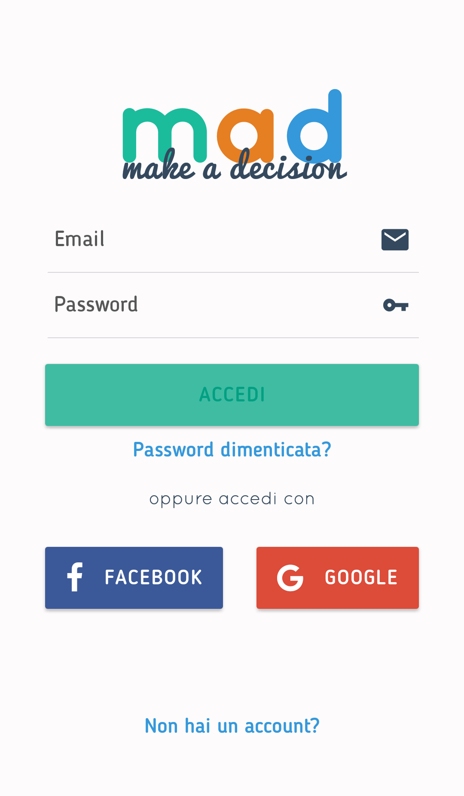
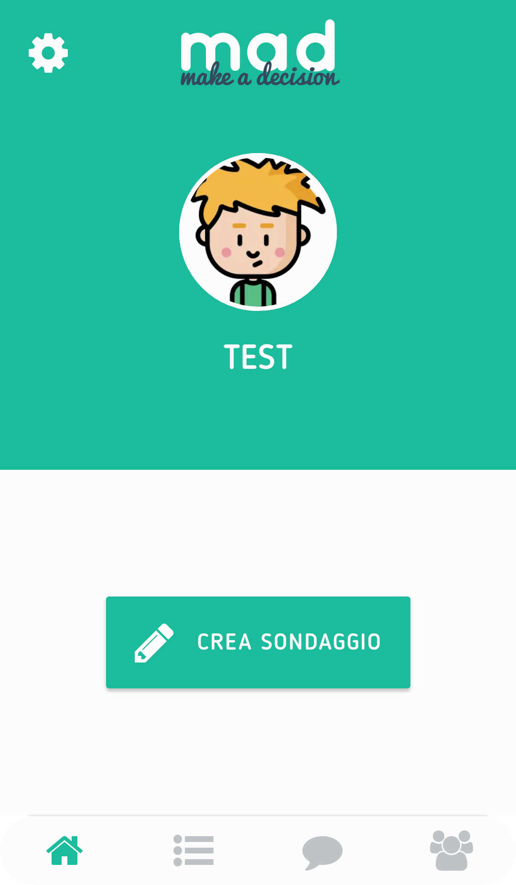
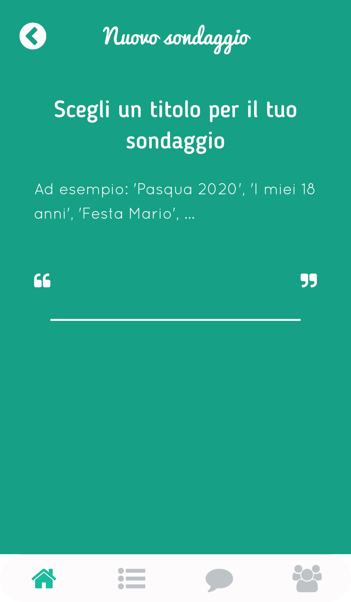

# mad
(make a decision) è un'app per prendere decisioni insieme ad altre persone.
Un utente può creare un sondaggio (contenente una o più domande), aggiungere le scelte possibili e condividerlo con gli amici.
Ogni utente invitato a partecipare al sondaggio può esprimere la propria preferenza votando. 

Progetto per:       __Laboratorio Avanzato di Programmazione II__

Realizzato da:      __Matteo Stracquadanio__

### Realizzato con:

<table>
    <tr>
        <td>
            
        </td>
        <td style="border: none" valign="middle">
            +
        </td>
        <td valign="middle">
            
        </td>
        <td valign="middle">React Native + Expo</td>
    </tr>
    <tr>
        <td colspan="3" valign="middle"></td>
        <td valign="middle">Firebase</td>
    </tr>
     <tr>
        <td colspan="3" valign="middle"></td>
        <td valign="middle">Redux</td>
    </tr>
</table>

### Screenshots:

    
    
    
    
    
    

